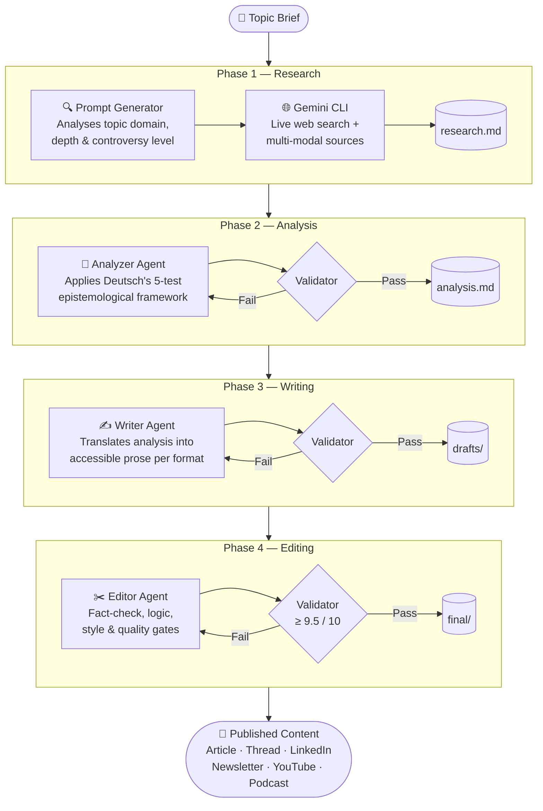
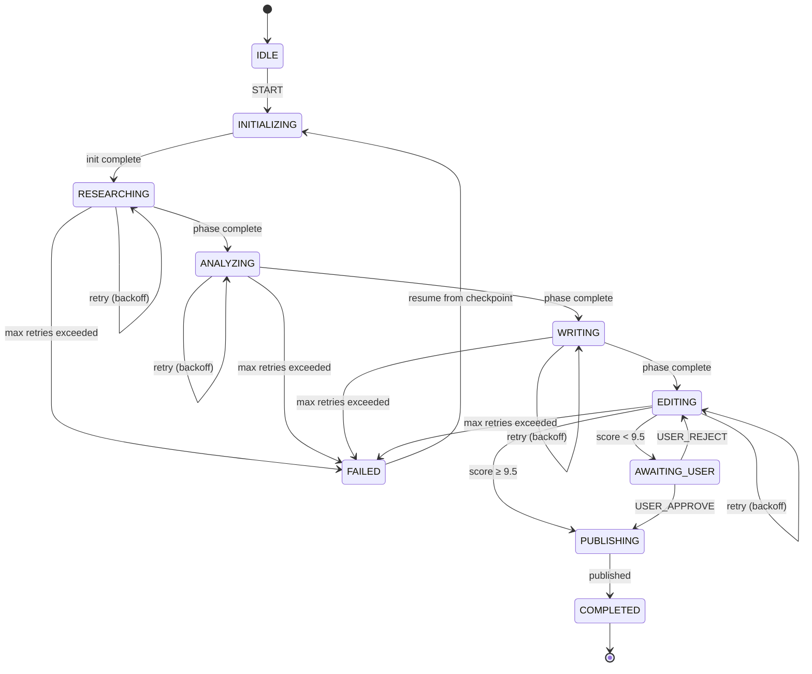
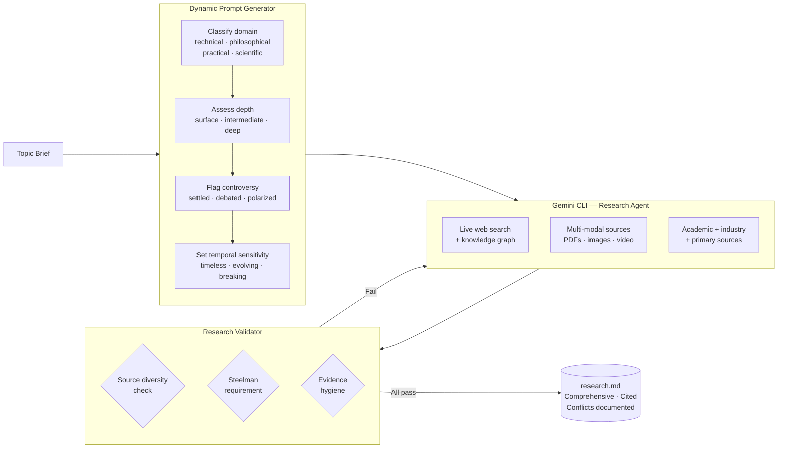

# Content Factory v2

A production-grade agentic content system built on David Deutsch's epistemological framework — creating explanatory content through systematic error elimination rather than single-shot generation.

---

## Core Pipeline



---

## Why Sequential, Not Parallel?

Each agent is a **specialised error-detection system** that can only do its job once the previous phase is complete. Error correction requires criticism, and criticism requires completed work to criticise.

| Agent | Error Type Caught | Requires |
|---|---|---|
| Researcher | Ignorance, selection bias, missing perspectives | Topic brief |
| Analyzer | Bad explanations, arbitrary claims, unfalsifiable theories | Complete research |
| Writer | Structural failures, inaccessible prose, format mismatch | Validated analysis |
| Editor | Factual errors, logic gaps, quality below threshold | Full draft |

---

## Orchestrator State Machine



---

## v2.3 Research Phase — Gemini CLI Integration



---

## Repo Structure

```
content-factory/
├── agents/                  # Agent prompt definitions (v1 + v2)
│   ├── researcher-agent-v2.md
│   ├── analyzer-agent-v2.md
│   ├── writer-agent-v2.md
│   ├── editor-agent-v2.md
│   ├── twitter-thread-agent-v2.md
│   └── ...
├── templates/               # Output templates per format
│   ├── article-template.md
│   ├── twitter-thread-template-v2.md
│   ├── linkedin-post-template.md
│   └── ...
├── src/content_factory/     # Core Python package
│   ├── orchestrator.py      # State-machine pipeline runner
│   ├── config.py            # Pipeline configuration
│   ├── cli.py               # CLI interface
│   ├── telemetry.py         # Structured logging & metrics
│   ├── tools/               # Ablation, analysis, dashboard
│   └── validators/          # Per-agent output validators
├── shared/deutsch-framework/ # Epistemological foundation
├── tests/                   # Unit + integration test suite
├── CONTENT-FACTORY-v2.3-DESIGN.md
├── HOW-THE-WORKFLOW-WORKS.md
├── EXECUTION_CHECKLIST.md
└── run-content-factory.md
```

---

## Installation & Quick Start

```bash
pip install -e ".[dev]"
```

```bash
# Run the full pipeline
content-factory run "Why goal-setting fails" \
    --formats article,twitter-thread,linkedin-post \
    --brief "Analyse why most goal-setting frameworks fail"

# Validate outputs
content-factory validate "why-goal-setting-fails"

# Open monitoring dashboard
content-factory dashboard --view full
```

---

## Supported Output Formats

| Format | Template | Agent |
|---|---|---|
| Long-form article | `article-template.md` | Writer → Editor |
| Twitter/X thread | `twitter-thread-template-v2.md` | Thread Agent → Editor |
| LinkedIn post | `linkedin-post-template.md` | Writer → Editor |
| Newsletter section | `newsletter-template.md` | Writer → Editor |
| YouTube script | `youtube-script-template.md` | Writer → Editor |
| Podcast notes | `podcast-notes-template.md` | Writer → Editor |

---

## Key Docs

| Doc | What it covers |
|---|---|
| `HOW-THE-WORKFLOW-WORKS.md` | Why the pipeline is designed this way |
| `CONTENT-FACTORY-v2.3-DESIGN.md` | v2.3 architecture with Gemini CLI research |
| `EXTERNAL-REVIEW-LESSONS.md` | What broke in external review & how the system was upgraded |
| `AGENTS.md` | Orchestration instructions for Claude |
| `GEMINI.md` | Orchestration instructions for Gemini |
